# Azure Dev Test Labsでテスト環境を構築してみる！

## 1. 前提条件

以下の準備が必要です。

* Microsoft Azureアカウント（無料試用版でも可です）
* Visual Studio（**Windows**）
* Visual Studio for Mac（**Mac**）
* Git
* AzCopy
  * [Mac](https://aka.ms/downloadazcopy-v10-mac)
  * [Windows-64bit](https://aka.ms/downloadazcopy-v10-windows)
* [Microsoft Remote Desktop(Macのみ)](https://apps.apple.com/jp/app/microsoft-remote-desktop/id1295203466?mt=12)
* 折れない心

## 2. ざっくりとした流れ

1. Azure devtest labs作る
2. 匿名ユーザーでも招待出来るようにVM作成(windows server)
3. VMが出来たら，RDPで入る
4. `IIS`インストール
5. `.NET Core`ホスティングバンドルのインストール
6. ネットワークインターフェースとの関連付け
7. Visual StudioからVMにBlazorアプリのデプロイ
   MacはローカルPCをVMへアタッチしてファイルを手動アップ
8. ブラウザで動作確認
9. 作成したVMをスナップショット
10. AzCopy を使用して VHD ファイルをアップロード

## 3. 手順

### 3.1. DevTest Labs作成

Azure Portalに入り，検索ボックスからDevTest Labsのサービスを検索し，選択します．

選択したらDevTest Labsのサービスへ移動するので，**追加**のボタンをクリックします．

DevTestのラボ作成画面が表示されるので基本設定情報を入力していきます．

| 項目名 | 入力値 |
| :---- | :---- |
| サブスクリプション | 無料枠での使用であれば**無料試用版**と出ていると思うのでそのままでOKです．  無料試用版でない方は自身のサブスクリプションを選択してください．|
| リソースグループ | 何も項目にないと思うので，**新規作成**のリンクをクリックし，作成してください． 命名は自由ではありますが，リソースグループは`rg-`で始まるのがMicrosoftの推奨とのことです． 命名規則を気にされる方は[こちら](https://docs.microsoft.com/ja-jp/azure/cloud-adoption-framework/ready/azure-best-practices/naming-and-tagging#general)にある**ResourceGroup**を参照いただければと思います．|
| ラボ名 |こちらは入力チェックに引っかからないように自由に決めてOKです．|
| 場所 | **東日本**を選択しましょう． |

自動シャットダウンを選択して，入力していきます．

| 項目名 | 入力値 |
| :---- | :---- |
| 有効 | リソース削除などをしていない場合のコスト管理としても事故らないように，**オン**にしておきましょう．  |
| スケジュールされたシャットダウン | 画像では19:00で設定していますが，meetupの時間を考慮して**21:00**で設定しましょう．|
| タイムゾーン | `(UTC+09:00) Osaka, Sapporo, Tokyo`を選択しましょう．|
| 自動シャットダウンの前に通知を送信しますか？ | 不要なので今回は**いいえ**にします |

ここまで入力が完了したら**確認および作成**のボタンをクリックしましょう．
Azureが検証をしてくれるので問題なければ**作成**のボタンをクリックします．

サービスのデプロイが始まるので，少し待ちましょう．完了すると以下のとおりに告知されるので**リソースに移動**で移動しましょう．

もちろんこの画面を離れても問題ないです．その場合はAzure Portalの通知からデプロイの進行状態が通知から確認できますので，こちらからでもOKです．

DevTest Labsの作成はこれで完了です．
次はVMの作成を行います．

### 3.2. DevTest LabsにVMを作成

DevTest Labs内で**追加**をクリックします．

ベースの選択が表示されるので**Windows Server 2019 Datacenter**を選択します．

選択するとラボリソースの作成画面が表示されるので基本設定情報を入力していきます． **※ユーザー名とパスワードは忘れないように控えておいて下さい．**

| 項目名 | 入力値 |
| :---- | :---- |
| 仮想マシン名 | 命名は自由ではありますが，VMは`vm-`で始まるのがMicrosoft推奨となります． |
| ユーザー名 | 自由入力となります．|
| 保存されているシークレットを試用する | 未チェックとします．|
| パスワード | 自由入力となります． |
| 規定のパスワードとして保存する | チェックします． |
| ディスクとサイズ | A3が標準で選択されますが，高いのでVMサイズを変更します．サイズの変更リンクをクリックするとサイズが表示されるのでB1msを選択します．|
| OSディスクの種類 | Standard HDDでOKです．|

自動シャットダウンを選択して，入力していきます．

| 項目名 | 入力値 |
| :---- | :---- |
| 仮想ネットワーク | 自動で選択されるので，そのままでOKです |
| サブネットセレクター | 自動で選択されので，そのままでOKです|
| IPアドレス | パプリックにします |
| 仮想マシンの有効期限| 未入力でOKです |
| このマシンを要求可能にする | **はい**を選択します|
| インスタンス数 | 1 |

入力が完了したら基本設定を選択して**作成**ボタンをクリックしてください．
デプロイが走りますので待ちましょう．VM作成は時間がかかるので10分ほど...
完了したらDevTest Labにて以下のように要求可能な仮想マシンが現れますので次へ進みます．

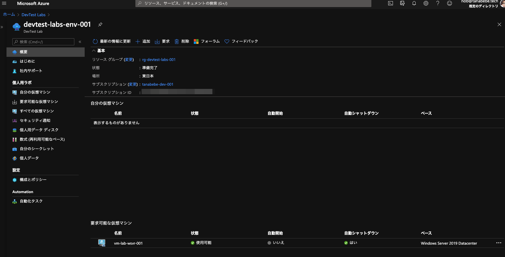

## 3.3. VMに接続する

以下のとおり，仮想マシンの要求を行います

要求が完了すると自分の仮想マシンとしてVMが表示されるので，接続を選択しRDPファイルをダウンロードします．

ダウンロードした`.rdp`ファイルをダブルクリックして仮想マシンに接続します． Macだと以下のようになりますが，**Continue**を選択してOKです．

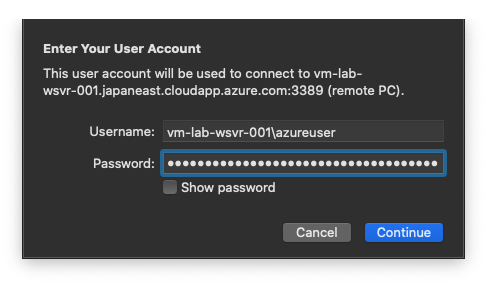

無事接続するとServerManagerが立ち上がります．

## 3.4. IISの設定を行う

これでWindows Serverへ接続する事が出来ました．Webサーバーとして使用するために，**IIS**をインストールしていきます．

**Add roles and features**をクリックします．

インストールウィザードが立ち上がるので，ここは**Next**で進みます．

ここも変更せず**Next**で進みます．

ここも変更せず，**Next**で進みます．

**Selectr server roles**まで来たら**Roles**内の`Web Server(IIS)`をクリックします． 
クリックするとダイアログが表示されますが，**Add Features**を選択してください．（以降も同じく）

以下のとおり，チェック済みとなればOKですので**Next**で進みます．

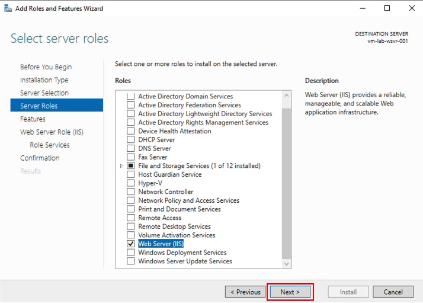

**Features**は変更しないので，**Next**で進みます．

**Web Server Role(IIS)**も**Next**で進みます．

**Role services**では`Management Service`を選択しチェック済みとなったら**Next**で進みます．

**Install**をクリックします．

Installation successとなればインストール完了なので**Close**で閉じます．

Azure Portalに戻り，動作しているか確認します． 検索したいサービスを入力し，Virtual Machinesを選択します．

対象のVMを選択し，VMの概要ページへ移動します．

パプリックIPをクリップボードにコピーして，ブラウザの別タブに貼り付けます．

以下のように画面が表示されればOKです． 
次は再度VMに接続し，サーバーホスティング用の`.NET Core`をインストールしていきます．

## 3.5. .NET Coreのインストール

再びRDPでWindows Serverを操作していきます． 今回は`Blazor Server`のアプリを**IIS**に実行してもらう必要があるため，`.NET Core`が必要となります． 
**IE**を開き，**Internet options**を選択します． インターネットからファイルのダウンロードを行うので，IEの設定を変更します．

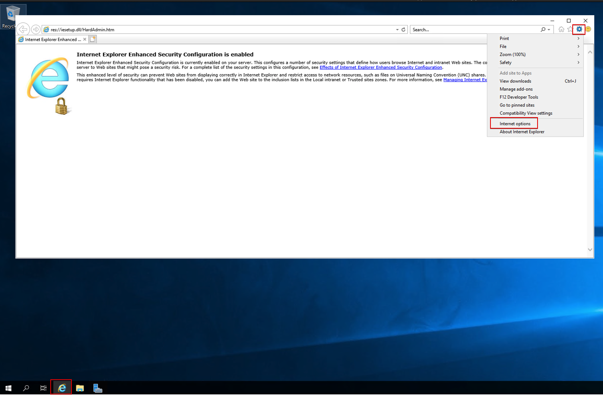

**File downlod**のチェックボックスを**Enable**にします．
警告が出ますが，Yesを押して下さい．

 

**Apply**をクリックした後，**OK**で閉じて下さい．

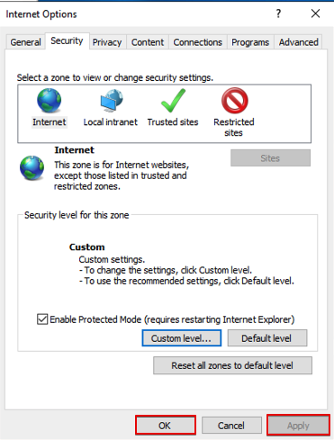

IEに[こちら](https://dotnet.microsoft.com/download/dotnet-core/3.1)のURLをコピペして下さい．
`.NET Core`のRuntimeが案内されている画面になるので，Windowsの**Hosting Bundle**をクリックします．

リンクをクリックして，ファイルをダウンロードします．（ファイルの保存先は任意）

ダウンロードした`dotnet-hosting-3.1.8-win.exe`をダブルクリックで実行します． 同意のチェックを入れ，インストールします．完了したら閉じましょう．

 

## 3.6. Web Deployのインストール

今度はVisual StudioからAzureにデプロイを簡略化するためにWeb Deployをインストールします．

[こちら](https://www.microsoft.com/ja-jp/download/details.aspx?id=43717)のURLをWindowsServerのIEへコピペして移動します． セキュリティ面での制限で画面が崩れている場合がありますが，ダウンロード出来るので以下の64bit側をダウンロードします．

ダウンロードした`WebDeoloy_amd64_ja-JP.msi`をダブルクリックして以下の通り，インストールします． ※標準インストールではないことに注意してください．

以降はファイルをダウンロードしないので**IE**を開き，**Internet options**を戻しておきます．

## 3.7. VMのDNSを構成する

Azure PortalからVirtual Machinesで作成したVMを選択し，DNS名の構成をクリック．

Visual Studioから発行するときにDNSでアクセス出来ないと駄目なので，任意のDNS名を付けましょう． **作成したVMのマシン名**がわかりやすくて良いと思います．変更したら**保存**をクリックします． 割り当ては動的としていますが，VMが再起動してもDNSで紐付くので問題ないです．

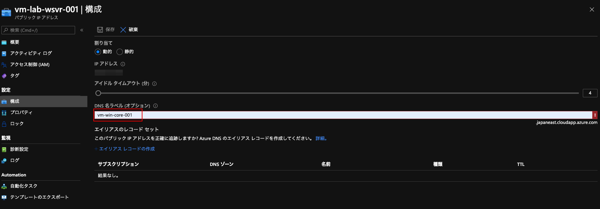

## 3.8. Visual StudioでBlazor Serverアプリを作成する

ここでWindowsとMacで手順が大きく変わりますので，自身の環境に合わせて読み進めてください．

### Macを使用している方

Visual Studio for MacではAzure VMへWebデプロイの機能が追いついていないため，別の対応方法を記載しています． 
Windiowsは全てVisual Studioで完結しますが，Macは少し違う手法を取ります．

プロジェクトの新規作成を選択します．

Blazor Serverを選択します．

認証なしでOKです．

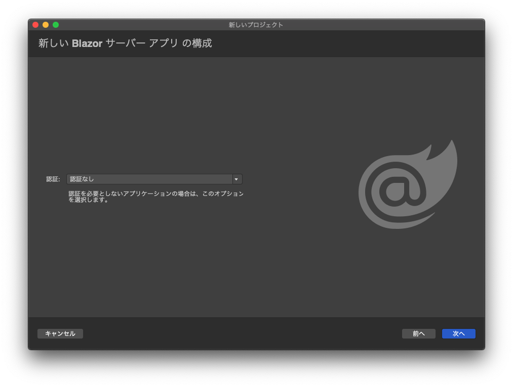

プロジェクト名や場所は任意なので，好きな名称を入力してください．

プロジェクトが作成されたらソリューションで**右クリック->公開->フォルダに公開**を選択してください．

公開先のフォルダを選択します． デフォルトのまま変更していないですが，任意です．

作成したプロジェクト内まで移動し，Finderを開きます．

以下のファイルをVM（Windows Server）へアタッチして，コピーしていきます．

VMに接続するときに使用した`.rdp`ファイルを**Microsoft Remote Desktop**へドラッグ&ドロップします．

パネルを右クリックし，**Edit**を選択，**Folders**のタブを選択し，**Redirect folders**にチェックを付けます． 
**[+]** ボタンをクリックして，Visual Studioで公開先で選択したフォルダを指定し，VMから誤ってファイルが削除されないように**Read-only**にチェックを付けます．
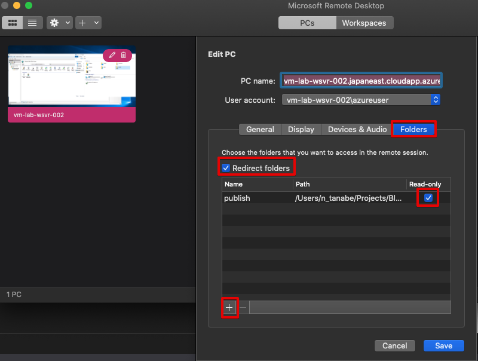

再びRDPに戻り，Server ManegerからIIS Managerを選択します．

Default Web Siteで**右クリック->Explore**を選択します．

Macの**Microsoft Remote Desktop**で設定したフォルダがアタッチされているのが確認できました． デプロイしたいファイル一式となります．

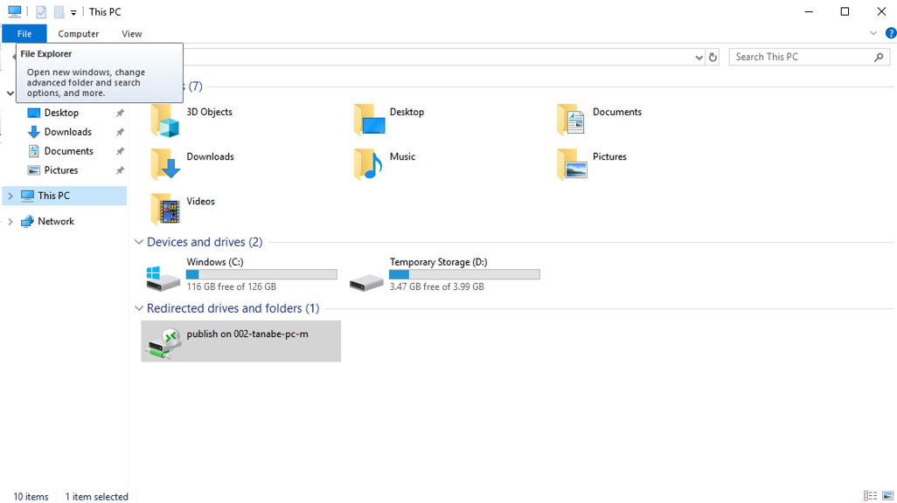

Windows Serverの`C:\inetpub\wwwroot`までエクスプローラーを開いて，上記手順で開いたMac内のファイルを全てコピーします． これでデプロイが完了です．
早速Webページを開いてみましょう．

Blazor Serverで作成されたページが表示されましたね． Macの場合は少し面倒ですが，デプロイ時は上記の手順を再度繰り返せばOKです．

### Windowsを使用している方

Visual Studioを開いて新規プロジェクトを作成します．

Blazorアプリを選択してください．

プロジェクト名や場所は任意です．

Blazorサーバーアプリを選択し，他は特に変更せず作成します．

Visual Studio上のアカウント設定から自身のAzureアカウントでログインしましょう．

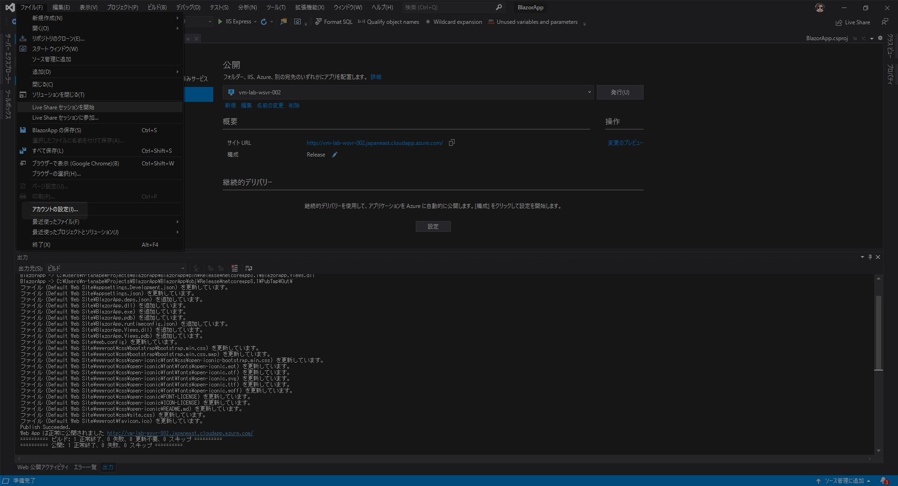

プロジェクトが作成されたらプロジェクトを右クリックし発行を選択します．

Azureを選択して次へ進みます．

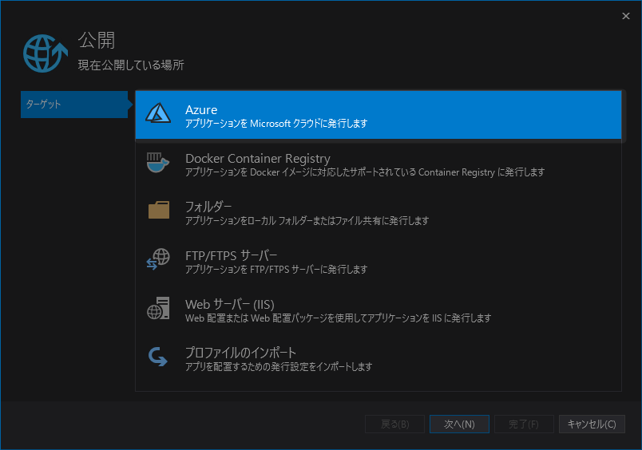

Azure Virtual Machineを選択し，次へ進みます．

作成したVirtual Machineを選択して，完了とします．

公開用のプロファイルが作成できたので，**発行**をクリックします．

VMで設定したパスワードを入力してOK，とするとデプロイが始まります．

正常にデプロイが完了すると以下のとおり，Visual Studio内での出力が確認できます．
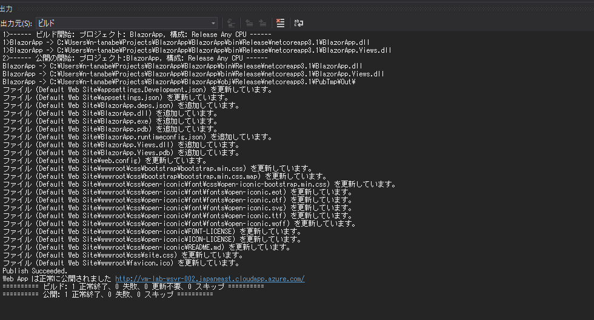

正常に完了したら早速Webページを開いてみましょう．

