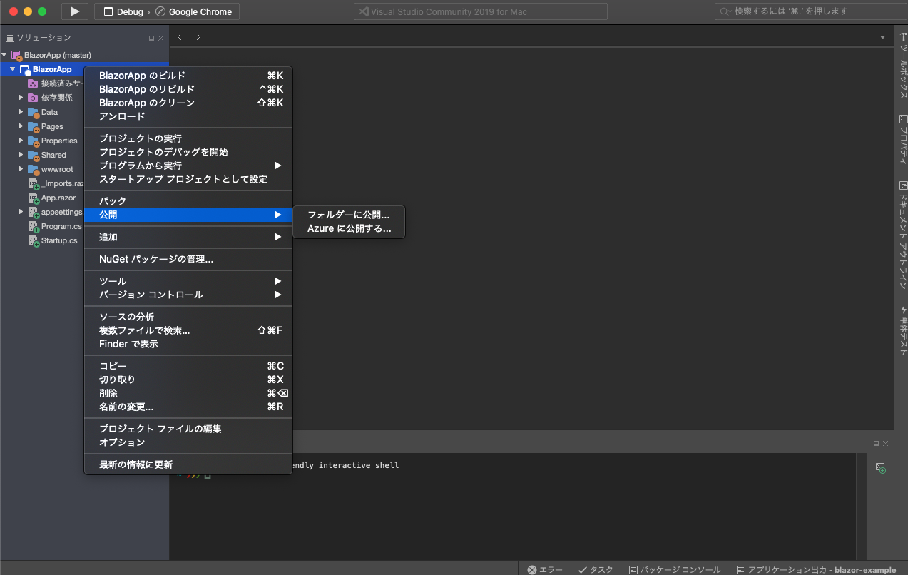
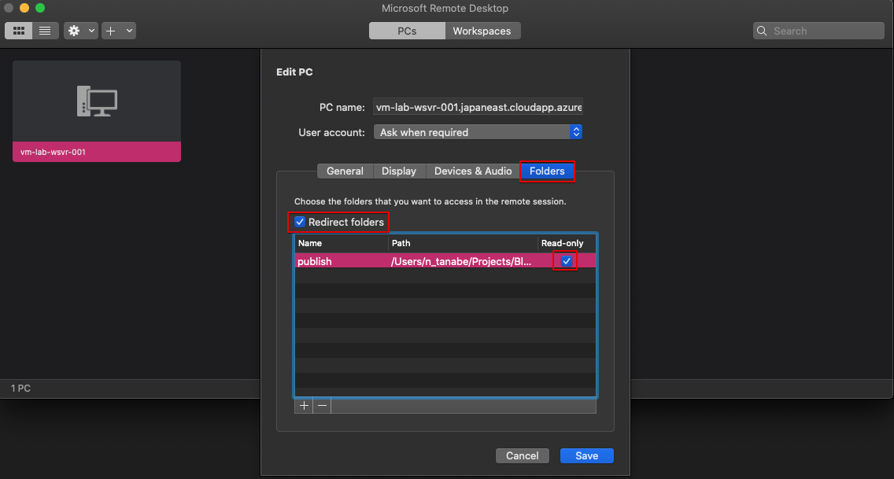

# 5.1. Macの場合

**Visual Studio for Mac**では**Azure VM**へWebデプロイの機能が追いついていないため，別の対応方法を記載しています． 
Windiowsは全てVisual Studioで完結しますが，Macは少し違う手法を取ります．

プロジェクトの新規作成を選択します．

**Blazor Server**を選択します．

認証なしでOKです．

プロジェクト名や場所は任意なので，好きな名称を入力してください．

プロジェクトが作成されたらソリューションで**右クリック->公開->フォルダに公開**を選択してください．

公開先のフォルダを選択します． デフォルトのまま変更していないですが，任意です．

作成したプロジェクト内まで移動し，Finderを開きます．

以下のフォルダを**Windows Server**へアタッチして，コピーしていきます．

VMに接続するときに使用した`.rdp`ファイルを**Microsoft Remote Desktop**へドラッグ&ドロップします．

パネルを右クリックし，**Edit**を選択，**Folders**のタブを選択し，**Redirect folders**にチェックを付けます． 
**[+]** ボタンをクリックして，Visual Studioで公開先で選択したフォルダを指定し，VMから誤ってファイルが削除されないように**Read-only**にチェックを付けます．

再び**Windows Server**に戻り，**Server Maneger**から**IIS Manager**を選択します．

**Default Web Site**で**右クリック->Explore**を選択します．

 

ファイルエクスプローラーが開きますので，このフォルダへファイルをアップロードしていきます。

更にファイルエクスプローラーを開き，Macの**Microsoft Remote Desktop**で設定したフォルダがアタッチされているのでダブルクリックして移動します． ※Macが見えない場合は**Microsoft Remote Desktop**を閉じて再度繋ぎ直してみてください．

上記手順で開いたMacのファイルを全てコピーします．

これでデプロイが完了です．
早速Webページを開いてみましょう．

Blazor Serverで作成されたページが表示されました． Macの場合は少し面倒ですが，デプロイ時は上記の手順を再度繰り返せばOKです．
