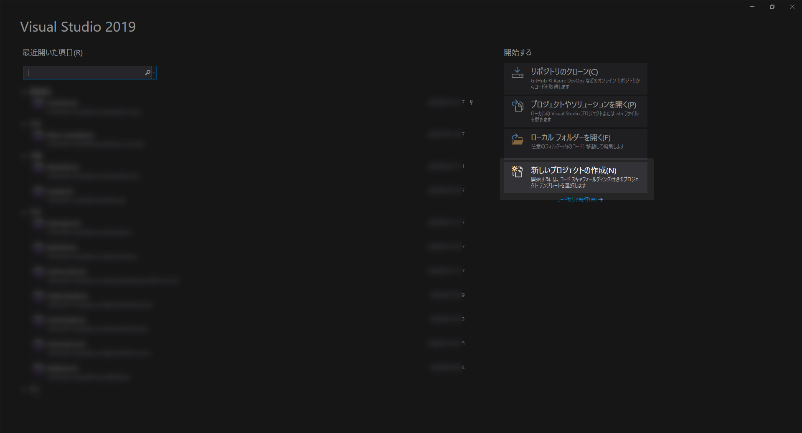
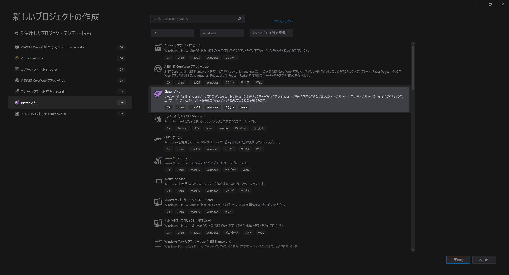
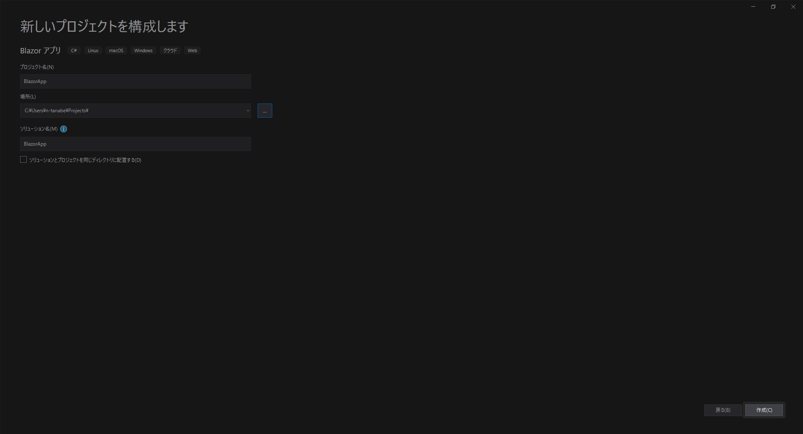
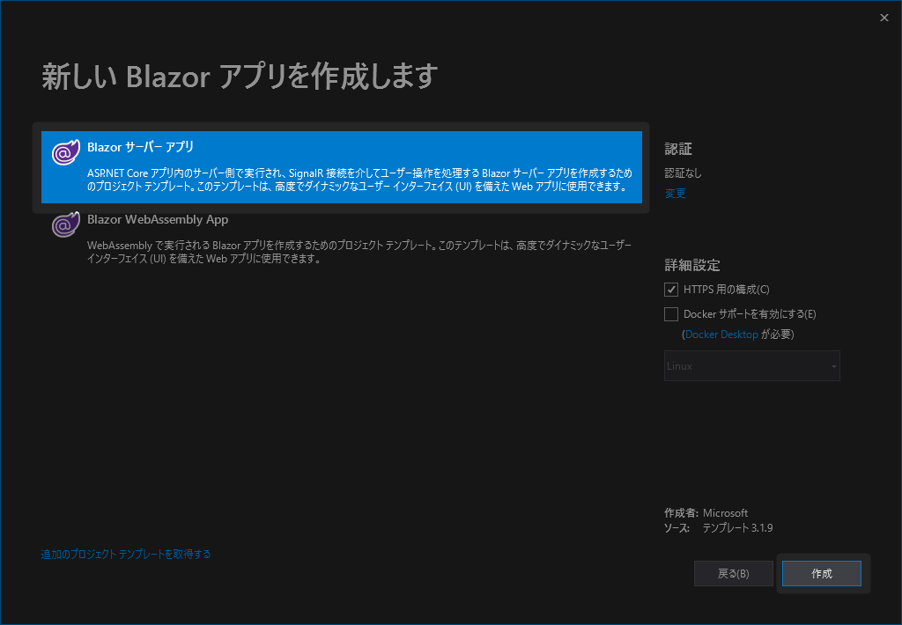
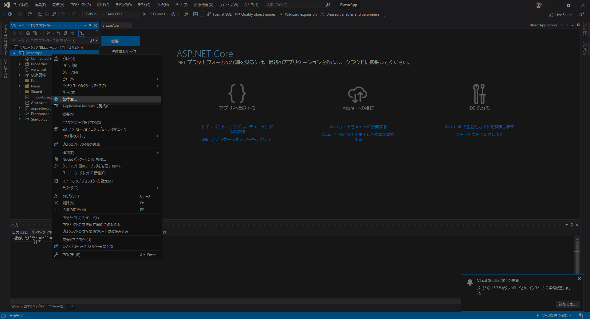
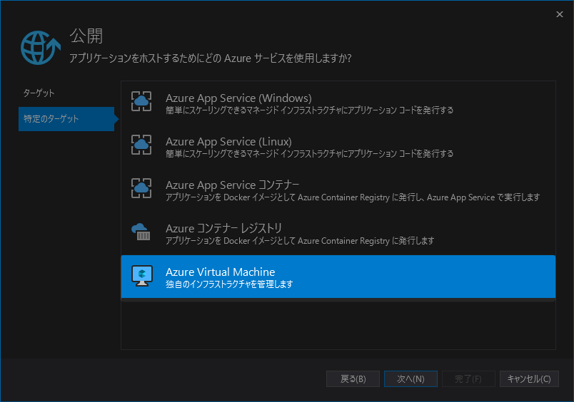
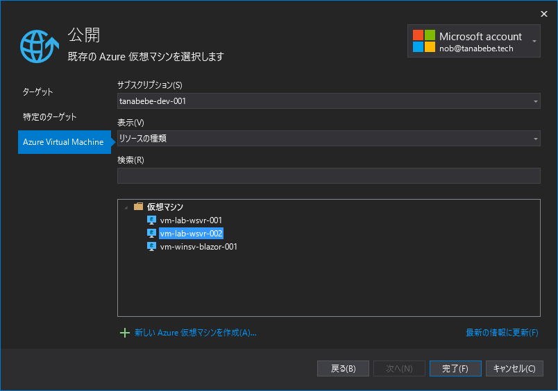
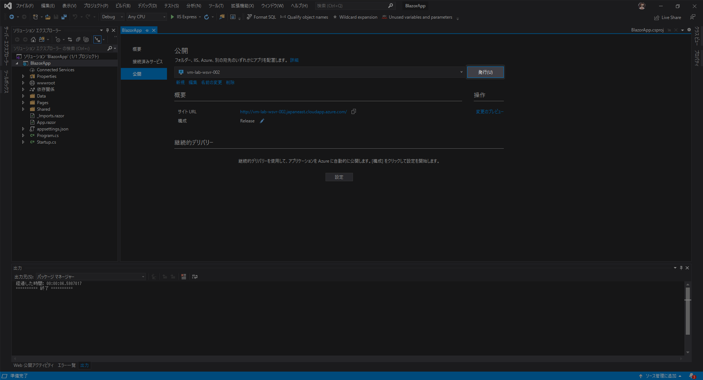
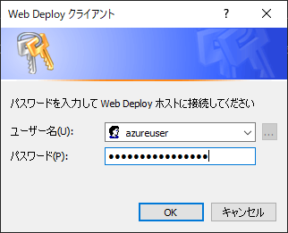
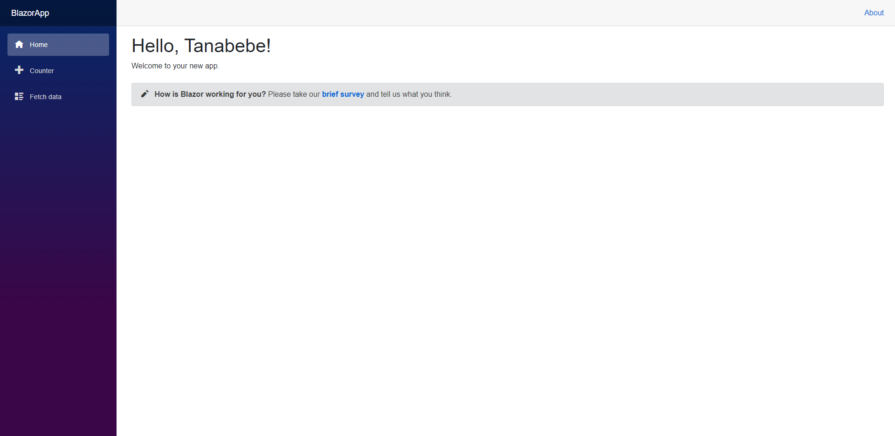

# 8.2. Windowsの場合

Visual Studioを開いて新規プロジェクトを作成します．

Blazorアプリを選択してください．

プロジェクト名や場所は任意です．

Blazorサーバーアプリを選択し，他は特に変更せず作成します．

Visual Studio上のアカウント設定から自身のAzureアカウントでログインしましょう．

プロジェクトが作成されたらプロジェクトを右クリックし発行を選択します．

Azureを選択して次へ進みます．

Azure Virtual Machineを選択し，次へ進みます．

作成したVirtual Machineを選択して，完了とします．

公開用のプロファイルが作成できたので，**発行**をクリックします．

VMで設定したパスワードを入力してOK，とするとデプロイが始まります．

正常にデプロイが完了すると以下のとおり，Visual Studio内での出力が確認できます．

正常に完了したら早速Webページを開いてみましょう．

